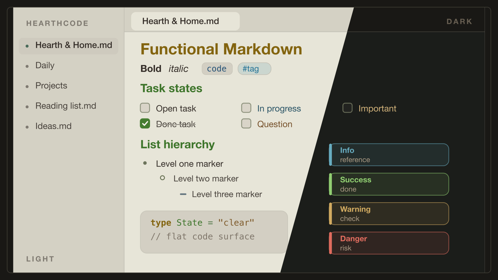

# HearthCode for Obsidian

Moss turns color into reading order for [Obsidian](https://obsidian.md). Its calm Dark and Light modes keep structured notes easy to scan without making the page noisy.

## Built for notes with structure

- Typed callouts keep notes, tips, questions, warnings, and danger states distinct.
- Task states, layered list markers, tag pills, code blocks, and quotes form a clear reading hierarchy.
- Edit and reading views share the same treatment, so a note does not change character when you switch modes.
- Dark and Light use the same semantic color language.

## Make it yours with Style Settings

With the optional **Style Settings** plugin, you can tune the parts that should be personal without breaking the calibrated palette:

- Typography: monospace notes, upright code-comment italics, and readable line length.
- Callout intensity: Quiet, Medium, or Bold.
- Accent: Moss, Amber, or Slate, each checked for text contrast.

## Install

### From Obsidian (recommended)

1. Open **Settings → Appearance → Themes → Manage**.
2. Search for **HearthCode** and click **Install and use**.

### Manual

1. Download `manifest.json` and `theme.css` from this repository.
2. Copy them into `<your-vault>/.obsidian/themes/HearthCode/`.
3. In **Settings → Appearance → Themes**, select **HearthCode**.

Homepage and editor-theme previews: <https://theme.hearthcode.dev>

## Source and support

This repository is the generated Obsidian publish target. Source, issues, and changes live in [hearth-code/HearthTheme](https://github.com/hearth-code/HearthTheme).

## License

[MIT](LICENSE)
